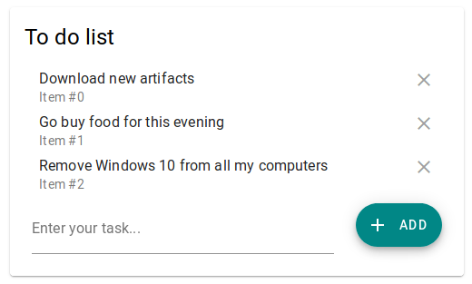

# Elm learning ToDo List

The goal of this project is to test and learn all the basic stuffs
related to the Elm framework.

It is just a simple To do list application made with [elm-mdc](https://github.com/aforemny/elm-mdc) which
offers all the material design components in Elm.

## Installation

The first step is to download the project's sources.

```shell script
git clone https://github.com/moutoum/elm-learning-todos.git
git submodule init
```

Then, build the `elm-mmdl` library.

```shell script
cd elm-mdc && make && cd -
```

And to finish, build the application:

```shell script
elm make src/Main.elm --output=app.js
```

> Be sure `Elm` is correctly installed in your environment

## Run

To run the project, just go to your favourite browser and open
the `index.html` page in the root directory of the project.

